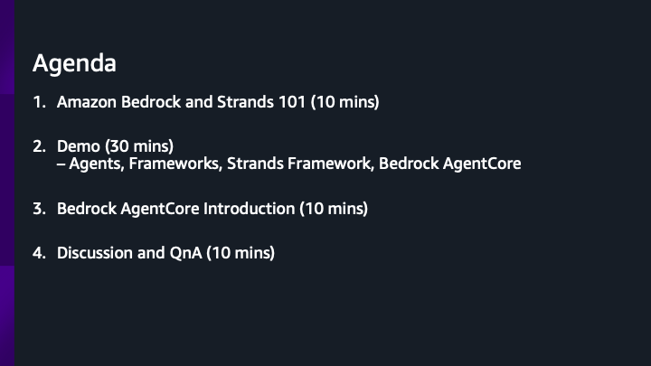
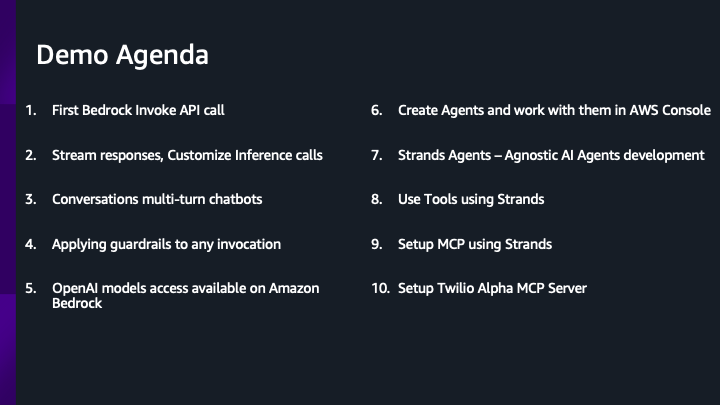
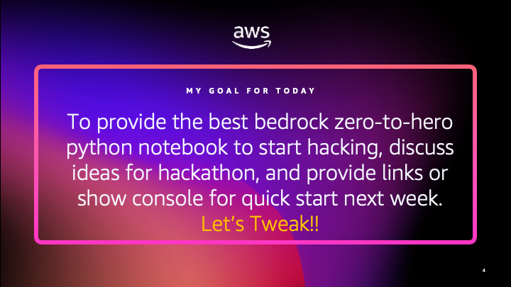

# Amazon Bedrock Zero-to-Hero

### *You have an Idea >> want generation/search workflow backed by an LLM >> Want minimal infra setup >> Use Bedrock*

Prepared for Twilio Hackathon (Tweek Week)

The repository contains a jupyter notebook that covers basics of Bedrock to more advanced concepts like using guardrails, Strands-Agents as an model-agnostic agent development framework, MCP, building tools and calls, and more. 

https://github.com/axehayz/amazon-bedrock-zero-to-hero/blob/main/bedrock-zero-to-hero.ipynb

Ensure you have AWS credentials and configuration setup.

The Agenda for the presentation on 8/14/2025:

Being a Hackathon - we will focus most on hands-on learning and demos

My goal for this hands-on workshop session is

